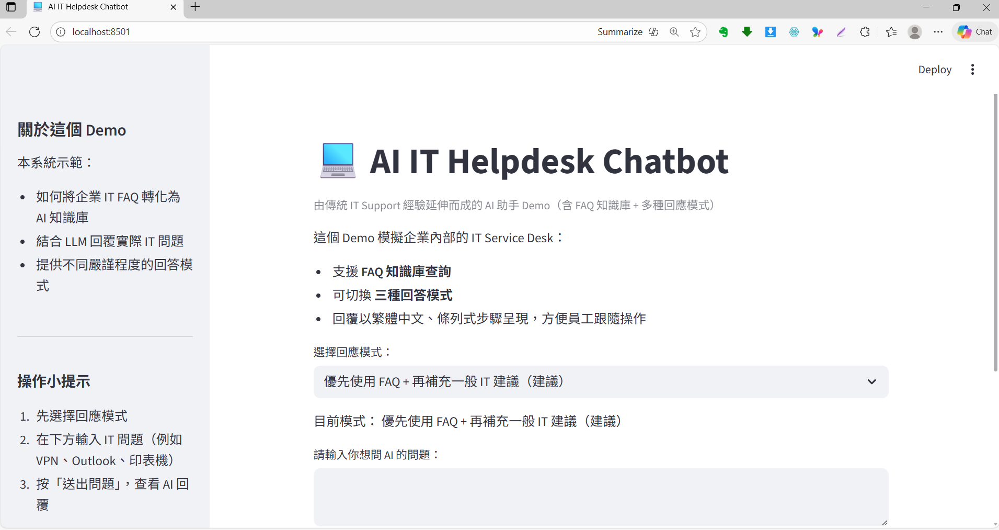

# AI IT Helpdesk Chatbot

AI-powered IT Helpdesk Chatbot with FAQ knowledge base, built with Streamlit + OpenAI.  
這是一個模擬企業內部 IT Service Desk 的 AI Chatbot Demo，由多年企業 IT Support 經驗延伸而成。  
系統結合 FAQ 知識庫 與 大型語言模型（LLM），讓員工可以用自然語言詢問 IT 問題。

---

## 功能簡介

- 支援以 CSV 管理的企業 IT FAQ 知識庫
- 能以繁體中文回答常見 IT 問題（VPN、Outlook、印表機、帳號密碼等）
- 提供三種回答模式：
  1. FAQ + LLM 混合模式（預設）：優先使用 FAQ，必要時由 LLM 補充 IT 最佳實務
  2. 僅使用 FAQ：只根據 FAQ 回答，找不到就明確回覆「知識庫無相關內容」
  3. 一般 IT 顧問模式：完全不參考 FAQ，以一般 IT Support 角度回覆
- 介面以 Streamlit 製作，適合 Demo 或企業內部 PoC（Proof of Concept）
- 可選擇顯示「本次回答所參考的 FAQ 內容」，方便 Debug 與對內解釋

---

## 技術架構

- 語言：Python 3.11
- 前端 / UI：Streamlit
- LLM：OpenAI Chat Completions API（亦可替換為 Azure OpenAI 等兼容服務）
- 資料存放：CSV（`data/faq.csv`）
- 設定與機密管理：
  - 使用 `.env` 存放 `OPENAI_API_KEY`
  - `config.py` 負責載入環境變數

---

## 專案結構

```bash
ai-it-helpdesk-chatbot/
├─ app.py                # Streamlit 主介面
├─ config.py             # 載入 .env 中的 OPENAI_API_KEY
├─ requirements.txt      # 專案相依套件
├─ data/
│  └─ faq.csv            # IT FAQ 知識庫（category, question, answer）
├─ services/
│  ├─ __init__.py
│  ├─ openai_client.py   # OpenAI API 封裝
│  └─ knowledge_base.py  # FAQ 讀取與關鍵字搜尋
└─ venv/                 # Python 虛擬環境（建議不要提交到 Git）
```

---

## 安裝與執行方式

以下步驟以命令列 / Terminal 操作為例。

### 1. 建立並啟動虛擬環境

```bash
# 建立虛擬環境
python -m venv venv

# 啟動虛擬環境（擇一）
venv\Scriptsctivate    # Windows

source venv/bin/activate # macOS / Linux
```

### 2. 安裝相依套件

```bash
pip install -r requirements.txt
```

### 3. 建立 `.env` 並設定 OpenAI API Key

在專案根目錄建立 `.env` 檔案，內容如下：

```env
OPENAI_API_KEY=你的_API_金鑰
```

> 注意：`.env` 不應加入 Git 或公開儲存庫。

### 4. 準備 FAQ 資料

- 檔案位置：`data/faq.csv`
- 建議欄位格式：

```csv
category,question,answer
VPN,VPN 連接不到公司網絡,請確認網絡正常、帳號密碼正確，必要時重新啟動設備或聯絡 IT。
Email,Outlook 一直要求輸入密碼,請確認帳號未被鎖定，並嘗試移除並重新新增 Outlook 帳戶。
```

你可以依公司實際情況擴充更多 category / question / answer 記錄。

### 5. 啟動系統

```bash
streamlit run app.py
```

啟動後，瀏覽器通常會自動開啟，例如：

- http://localhost:8501

---

## 回應模式說明

系統內建三種模式，可在 UI 中選擇切換：

1. 優先使用 FAQ（預設）

   - 先嘗試以 FAQ 回答使用者問題
   - 若 FAQ 資訊不足，再由 LLM 補充一般 IT 最佳實務建議

2. 僅使用 FAQ

   - 完全依據 FAQ 回答
   - 若 FAQ 找不到對應條目，會明確回覆「知識庫無相關內容」

3. 一般 IT 顧問模式
   - 不參考 FAQ
   - 以 IT Support 專業角度，由 LLM 直接產生建議回答

---

## FAQ 知識庫與可解釋性

Chatbot 可顯示：

- 本次回覆所參考的 FAQ 條目
- 對應的問題與答案內容

這有助於：

- 讓 IT 部門清楚知道 AI 回答是否符合公司政策
- 找出需要優化或補充的 FAQ
- 對內 Demo 或與主管溝通時，提升可解釋性與信任度

---

## 未來可延伸方向（Roadmap）

- 整合向量資料庫（如 Chroma、FAISS），支援更彈性的語意搜尋
- 依員工角色 / 部門自動調整回答內容（RBAC / Policy-based 回應）
- 串接 ServiceNow / JIRA / Freshservice 等工單系統
- 加入多語言支援（例如中英並行回答）
- 部署至企業內網伺服器或雲端（Azure / AWS 等）

---

## 作者簡介

- 具備 20+ 年企業 IT Support / Information Systems 實戰經驗
- 熟悉 AD、VPN、Outlook、Printer、帳號管理等日常 IT 支援流程
- 2024–2025 完成多項 AI / LLM 相關線上課程（Coursera / Google 等）
- 專注於將 AI 技術應用於企業 IT 支援、自動化與實務場景

如果你正在評估如何在公司內部導入 AI 協助 IT Support，歡迎 Fork 本專案並依照你們的 FAQ 與政策調整。

## 🖼️ 介面截圖



---
